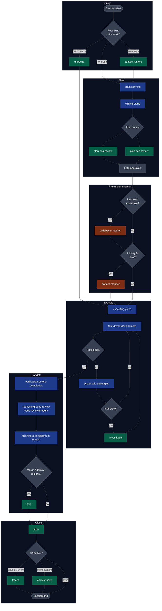

# claude-code-kit

An opinionated starter kit for [Claude Code](https://docs.anthropic.com/claude-code) — the configuration, the agents, the skills, and the notification hooks — packaged so you can drop it into a fresh machine and have a working setup in under a minute.

## The stack

This kit sits on top of two upstream layers. From bottom to top:

```
┌──────────────────────────────────────────────────────────┐
│  claude-code-kit  →  gstack (9 skills) + gsd (2 agents)  │  ← this repo
│                     + settings, statusline, notify hooks │
├──────────────────────────────────────────────────────────┤
│  everything-claude-code  →  180+ skills, 36+ agents      │  ← optional
│  (affaan-m/everything-claude-code)                       │
├──────────────────────────────────────────────────────────┤
│  superpowers  →  brainstorming, systematic-debugging,    │  ← required
│                  TDD, writing-plans, executing-plans,    │
│                  using-git-worktrees, verification-before│
│                  -completion, code-reviewer agent, …     │
├──────────────────────────────────────────────────────────┤
│  Claude Code CLI                                         │
└──────────────────────────────────────────────────────────┘
```

- **superpowers** (required) — Anthropic's skill-based workflow plugin. Provides the discipline primitives (brainstorming, systematic-debugging, TDD, writing/executing plans, git worktrees, verification, code review). Everything else composes with these.
- **everything-claude-code** (optional) — a much larger community library by [@affaan-m](https://github.com/affaan-m/everything-claude-code) that layers additional skills and agents on top of superpowers. Worth installing if you want the full buffet.
- **claude-code-kit** (this repo) — a narrow, opinionated set of 9 workflow skills (`gstack`) and 2 subagents (`gsd`) curated and adapted from the broader ecosystem, plus sanitized `settings.json`, a status line, and notification hooks. The skills explicitly reference and compose with `superpowers:*` primitives — they're extensions, not replacements.

## How it all fits together

**Legend:** 🟦 superpowers skill &nbsp; 🟩 gstack skill (this kit) &nbsp; 🟧 gsd agent (this kit) &nbsp; ⬜ decision / state



## What's inside

```
claude-code-kit/
├── .claude/
│   ├── settings.template.json   # Sanitized settings.json — model, hooks, plugins
│   ├── agents/                  # gsd — 2 curated subagents
│   ├── skills/                  # gstack — 9 curated workflow skills
│   ├── statusline-command.sh    # Status line: tokens, context %, rate-limit bars
│   ├── terminal-notify.js       # Windows Terminal color-per-state hook
│   └── terminal-notify.ps1      # Same, PowerShell variant
├── docs/
│   ├── plugins.md               # superpowers, frontend-design, code-simplifier
│   ├── hooks.md                 # What each notification hook does
│   └── mcp-servers.md           # How to wire MCP servers (optional)
├── install.sh                   # POSIX installer
├── install.ps1                  # Windows installer
└── LICENSE                      # MIT
```

## Quick start

```bash
git clone https://github.com/kaushiksiva07/claude-code-kit.git
cd claude-code-kit
./install.sh          # or: pwsh -File install.ps1
```

The installer copies everything into `~/.claude/` (respects `$CLAUDE_HOME`) and drops `settings.template.json` at `~/.claude/settings.json` **only if it doesn't already exist** — your existing config is safe.

Then, inside Claude Code, install the plugins listed in [docs/plugins.md](docs/plugins.md) (at minimum: `superpowers`) and restart.

## The upstream layers, documented

- **[docs/superpowers.md](docs/superpowers.md)** — full tables for the 14 skills, 1 agent, and 3 commands that superpowers ships.
- **[docs/everything-claude-code.md](docs/everything-claude-code.md)** — the 13 agents and 4 skills this kit actually pulls from `everything-claude-code` (upstream has 48 and 183), plus the filters used to pick them.

Both docs are structured like the `gstack` / `gsd` tables below — name and one-line description per row — so you can scan the whole ecosystem in one place.

## `gstack` — 9 workflow skills (this kit)

Sprint-loop primitives that compose with superpowers' discipline skills:

| Skill             | When to use it                                                           |
|-------------------|--------------------------------------------------------------------------|
| `investigate`     | Heavier-weight forensic pass when `superpowers:systematic-debugging` doesn't close the bug |
| `plan-eng-review` | Review a plan for engineering soundness before `/execute-plan`            |
| `plan-ceo-review` | Review a plan against product strategy / user value                      |
| `ship`            | Final pre-handoff gate — tests, review, scope-drift, verify-after-deploy |
| `retro`           | Post-ship retrospective that turns lessons into durable memory           |
| `context-save`    | Snapshot the session's working context into a durable file               |
| `context-restore` | Load a saved context into a new session                                  |
| `freeze`          | Pause point — stash open threads, mark where work left off               |
| `unfreeze`        | Resume from a freeze cleanly                                             |

## `gsd` — 2 subagents (this kit)

Delegate-and-summarize agents that do heavy work on a narrow task so the parent session stays lean:

| Agent             | Role                                                                     |
|-------------------|--------------------------------------------------------------------------|
| `codebase-mapper` | One-shot audit of an unfamiliar codebase (stack, architecture, concerns) |
| `pattern-mapper`  | "Which existing files should new files copy patterns from?" pre-implementation |

Both were written with a Kotlin/Android + Python Lambda codebase in mind — their examples reference those stacks. The structure (role/data-flow classification, forbidden-file rules, template-based output) generalizes; edit the role tables in the agent files to match your stack.

## What the settings template gives you

- `model: opus`, `effortLevel: xhigh` — lean into the smartest settings by default.
- `defaultMode: auto` + `skipAutoPermissionPrompt: true` — Claude runs without constant permission prompts. Revert if you want stricter gates.
- `CLAUDE_CODE_DISABLE_1M_CONTEXT=1` — stays on 200K context (cheaper, faster). Remove the env var if you need the long window.
- Status line with tokens / context usage / 5-hour + 7-day rate-limit bars.
- Notification hooks that recolor the current Windows Terminal tab on state changes. See [docs/hooks.md](docs/hooks.md).

## Re-running the installer

Safe. It overwrites agents, skills, and the scripts (that's how you pick up updates from the repo), but never overwrites your `settings.json`.

## Credits

- Built on top of Anthropic's [superpowers](https://github.com/anthropics/claude-code) plugin — the foundation that makes the skill-based workflow possible.
- Curated and adapted, with inspiration from [`affaan-m/everything-claude-code`](https://github.com/affaan-m/everything-claude-code) — the broader community library worth checking out if you want more than this kit provides.

## License

[MIT](LICENSE)
